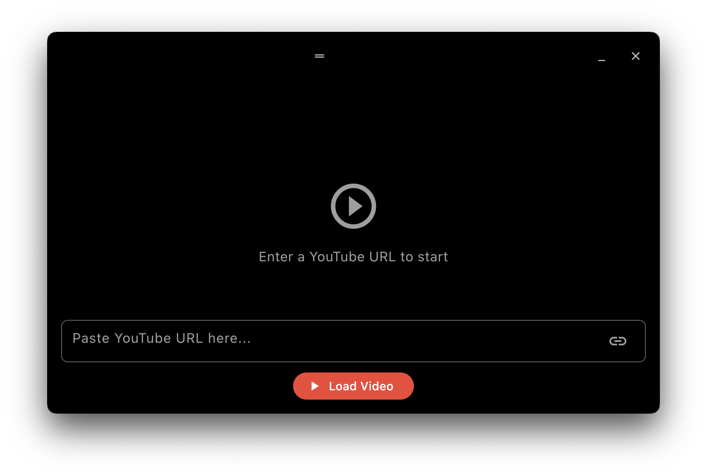
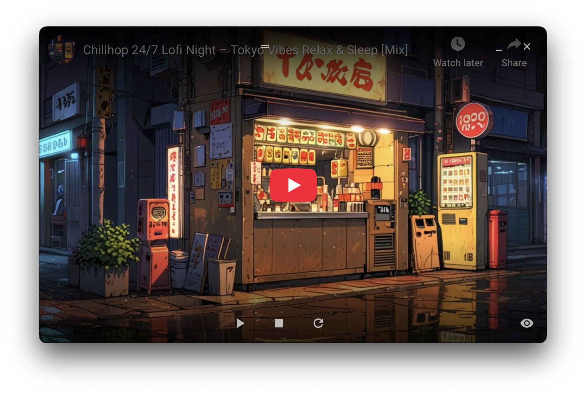

# YouTube Widget for macOS

A minimalist, always-on-top YouTube video player widget for macOS, built with Flutter. This application provides a clean, frameless interface for playing YouTube videos, with essential controls and keyboard shortcuts.

## ✨ Features

*   **Frameless Window:** A sleek, borderless window for an immersive viewing experience.
*   **Always On Top:** Keeps the video player visible over other applications.
*   **Resizable Window:** Adjust the window size to your preference.
*   **Drag to Move:** Easily reposition the frameless window by dragging any part of it.
*   **YouTube Video Playback:** Embeds and plays YouTube videos using `webview_flutter`.
*   **Play/Pause/Stop Controls:** Standard media playback buttons.
*   **Volume Control:** Adjust video volume with a slider and mute/unmute button.
*   **Progress Bar & Seeking:** See video progress and jump to any timestamp (for non-live videos).
*   **Live Stream Detection:** Automatically displays a "LIVE" indicator instead of a progress bar for live streams.
*   **Remember Last Played URL:** Automatically loads the last successfully played YouTube video on startup.
*   **Improved Error Messages:** Provides specific feedback for common video loading or playback issues.
*   **Keyboard Shortcuts:**
    *   `Spacebar`: Toggle visibility of the control overlay (input field, play/pause/stop buttons).
    *   `Cmd + C`: Toggle visibility of the progress bar and volume controls (for a tidier look).
    *   `P`: Toggle Play/Pause.
    *   `S`: Stop video playback.
    *   `Cmd + Shift + Enter`: Toggle fullscreen mode.
    *   `Cmd + Q`: Quit the application.

## 📸 Screenshots

  | Start Window                     |  On Playing                     |
  | -------------------------------- | -------------------------------- |
  |  |  |

---

## 🚀 Getting Started

### Prerequisites

Before you begin, ensure you have the following installed:

*   **Flutter SDK:** [Install Flutter](https://flutter.dev/docs/get-started/install)
*   **Xcode:** Required for macOS development. Install from the Mac App Store.
*   **ImageMagick:** (For generating app icons for distribution)
    ```bash
    brew install imagemagick
    ```
*   **create-dmg:** (For creating `.dmg` installers for distribution)
    ```bash
    brew install create-dmg
    ```

### Installation & Running in Debug Mode

1.  **Clone the repository:**
    ```bash
    git clone https://github.com/chunghha/youtube_widget_macos.git
    cd youtube_widget_macos
    ```
2.  **Get Flutter dependencies:**
    ```bash
    flutter pub get
    ```
3.  **Configure macOS Native Project (Crucial for Fullscreen):**
    Open your macOS project in Xcode:
    ```bash
    open macos/Runner.xcworkspace
    ```
    In Xcode, navigate to `Runner` -> `Runner` -> `MainFlutterWindow.swift`.
    Ensure the `styleMask` and `collectionBehavior` are set as follows within the `awakeFromNib()` method:

    ```swift
    import Cocoa
    import FlutterMacOS
    import window_manager

    class MainFlutterWindow: NSWindow {
      override func awakeFromNib() {
        let flutterViewController = FlutterViewController()
        let windowFrame = self.frame
        self.contentViewController = flutterViewController
        self.setFrame(windowFrame, display: true)

        self.styleMask = [
          .titled,
          .closable,
          .miniaturizable,
          .resizable // Crucial for true fullscreen
        ]

        self.collectionBehavior = .fullScreenPrimary // Crucial for true fullscreen

        self.minFullScreenContentSize = NSSize(width: 300, height: 300)
        self.maxFullScreenContentSize = NSSize(width: 1728, height: 1080) // Adjust to your screen's resolution or larger

        RegisterGeneratedPlugins(registry: flutterViewController)

        super.awakeFromNib()
      }
    }
    ```
    **Note:** The `maxFullScreenContentSize` should be set to a resolution equal to or greater than your target display's resolution for true fullscreen to work correctly.

4.  **Run the app:**
    ```bash
    flutter run -d macos
    ```

---

## 📦 Building for Distribution (macOS)

To create a distributable `.dmg` installer for your macOS app:

### 1. Prepare Your App Icon

1.  Place your `512x512` `icon.png` file in `assets/icon/icon.png`.
2.  **Generate macOS `.icns` file:**
    Create a script (e.g., `generate_macos_icons.sh`) in your project root:
    ```bash
    #!/bin/bash
    SOURCE_ICON="assets/icon/icon.png"
    OUTPUT_DIR="AppIcon.iconset"

    if ! command -v magick &> /dev/null; then
        echo "Error: ImageMagick 'magick' command not found. Please install it (e.g., 'brew install imagemagick')."
        exit 1
    fi
    if [ ! -f "$SOURCE_ICON" ]; then
        echo "Error: Source icon '$SOURCE_ICON' not found."
        exit 1
    fi

    rm -rf "$OUTPUT_DIR"
    mkdir -p "$OUTPUT_DIR"

    declare -A ICON_SIZES
    ICON_SIZES=(
       ="icon_16x16.png"="icon_16x16@2x.png icon_32x32.png"
       ="icon_32x32@2x.png"="icon_128x128.png"
       ="icon_128x128@2x.png icon_256x256.png"
       ="icon_256x256@2x.png icon_512x512.png"
       ="icon_512x512@2x.png"
    )

    for size in "${!ICON_SIZES[@]}"; do
        filenames=${ICON_SIZES[$size]}
        for filename in $filenames; do
            magick convert "$SOURCE_ICON" -resize "${size}x${size}" "$OUTPUT_DIR/$filename"
        done
    done

    iconutil -c icns "$OUTPUT_DIR"
    cp AppIcon.icns macos/Runner/Assets.xcassets/AppIcon.appiconset/
    rm -rf "$OUTPUT_DIR" AppIcon.icns
    echo "macOS icon generated and placed."
    ```
    Make the script executable: `chmod +x generate_macos_icons.sh`
    Run the script: `./generate_macos_icons.sh`

### 2. Build Release Version

```bash
flutter build macos --release
```
This will create your app bundle at `build/macos/Build/Products/Release/YouTubeWidget.app` (replace `YouTubeWidget` with your app's actual name from `pubspec.yaml`).

### 3. Create `.dmg` Installer

1.  **Prepare DMG Assets (Optional):** Create a background image (e.g., `dmg_assets/dmg_background.png`) and/or a license file (`dmg_assets/LICENSE.rtf`).
2.  **Run `create-dmg`:**
    ```bash
    APP_NAME="YouTubeWidget" # Replace with your app name
    APP_PATH="build/macos/Build/Products/Release/$APP_NAME.app"
    DMG_NAME="$APP_NAME Installer.dmg"
    DMG_BACKGROUND_IMAGE="dmg_assets/dmg_background.png" # Optional: path to your background image

    create-dmg \
      --volname "$APP_NAME Installer" \
      --volicon "$APP_PATH/Contents/Resources/AppIcon.icns" \
      --background "$DMG_BACKGROUND_IMAGE" \
      --window-pos 200 120 \
      --window-size 700 500 \
      --icon-size 100 \
      --text-size 14 \
      --hide-sidebar \
      --hide-status-bar \
      --app-drop-x 180 --app-drop-y 300 \
      --applications-dir-x 520 --applications-dir-y 300 \
      "$DMG_NAME" \
      "$APP_PATH"
      # Uncomment below if you have a license file:
      # --eula "dmg_assets/LICENSE.rtf"
    ```
    The `.dmg` file will be created in your project root.

### 4. Code Signing & Notarization (Highly Recommended for Distribution)

For users to run your app without Gatekeeper warnings, you need an Apple Developer Program membership ($99/year) to code sign and notarize your app.

1.  **Open Xcode:** `open macos/Runner.xcworkspace`
2.  **Signing:** In `Runner` target -> `Signing & Capabilities`, enable "Automatically manage signing" and select your team.
3.  **Archive:** `Product` -> `Archive`.
4.  **Distribute App:** In the Organizer window, select your archive, click "Distribute App", choose "Developer ID", and then "Notarize". Follow the prompts.
5.  **Staple:** After successful notarization (you'll get an email), export the notarized app from Xcode Organizer or use `xcrun stapler staple "path/to/your_notarized_app.app"`.
6.  **Re-create DMG:** Use the `create-dmg` command from step 3 with the **notarized `.app` bundle**.

---

## 🎮 Usage

1.  **Launch the app.**
2.  **Enter YouTube URL:** Paste a YouTube video URL into the input field at the bottom and press `Enter` or click "Load Video".
3.  **Controls:**
    *   **Mouse Hover:** Move your mouse over the window to reveal the controls. Move it away to hide them.
    *   **Spacebar:** Toggle the visibility of the entire control overlay.
    *   **Play/Pause/Stop/Refresh:** Use the buttons in the bottom center.
    *   **Volume:** Use the volume slider and mute/unmute icon.
    *   **Progress Bar:** Drag the slider to seek (for non-live videos).
    *   **Minimize/Close:** Use the icons in the top right.
4.  **Keyboard Shortcuts:**
    *   `Spacebar`: Toggle control overlay visibility.
    *   `Cmd + C`: Toggle visibility of the progress bar and volume controls.
    *   `P`: Toggle Play/Pause.
    *   `S`: Stop video.
    *   `Cmd + Shift + Enter`: Toggle fullscreen.
    *   `Cmd + Q`: Quit app.

---

## 📂 Project Structure

The project is organized with a clear separation of concerns:

```
lib/
├── main.dart                 # Main entry point, window manager setup
├── youtube_widget_app.dart   # Root MaterialApp definition
├── screens/
│   └── youtube_widget_screen.dart # Main screen, orchestrates UI and services
├── widgets/
│   ├── control_overlay.dart  # UI for all player controls (buttons, sliders, input)
│   └── webview_player.dart   # UI for the WebView and loading/error states
├── services/
│   ├── keyboard_service.dart # Handles global keyboard shortcuts
│   ├── window_service.dart   # Encapsulates window_manager interactions
│   ├── shared_preferences_service.dart # Handles saving/loading user preferences
│   └── youtube_webview_manager.dart # Manages WebViewController, JS communication, and player state
└── utils/
    └── youtube_url_parser.dart # Utility for extracting YouTube video IDs
└── config/
    └── app_config.dart       # Centralized application configuration constants
```

---

## 💡 Future Enhancements

*   **Progress Bar & Seeking for Live Streams:** Implement a "seek to live" button or a different progress indicator for live content.
*   **Playlist Support:** Allow loading and navigating YouTube playlists.
*   **Video Quality Selection:** Add an option to change video playback quality.
*   **Picture-in-Picture (PiP) Mode:** Implement native macOS PiP functionality.
*   **More Robust Error Handling:** Granular error states and recovery options.
*   **Theming Options:** Allow users to customize colors or themes.

---

## 🤝 Contributing

Contributions are welcome! If you have suggestions, bug reports, or want to contribute code, please open an issue or submit a pull request.

---

## 📄 License

This project is licensed under the MIT License - see the [LICENSE](LICENSE) file for details.
